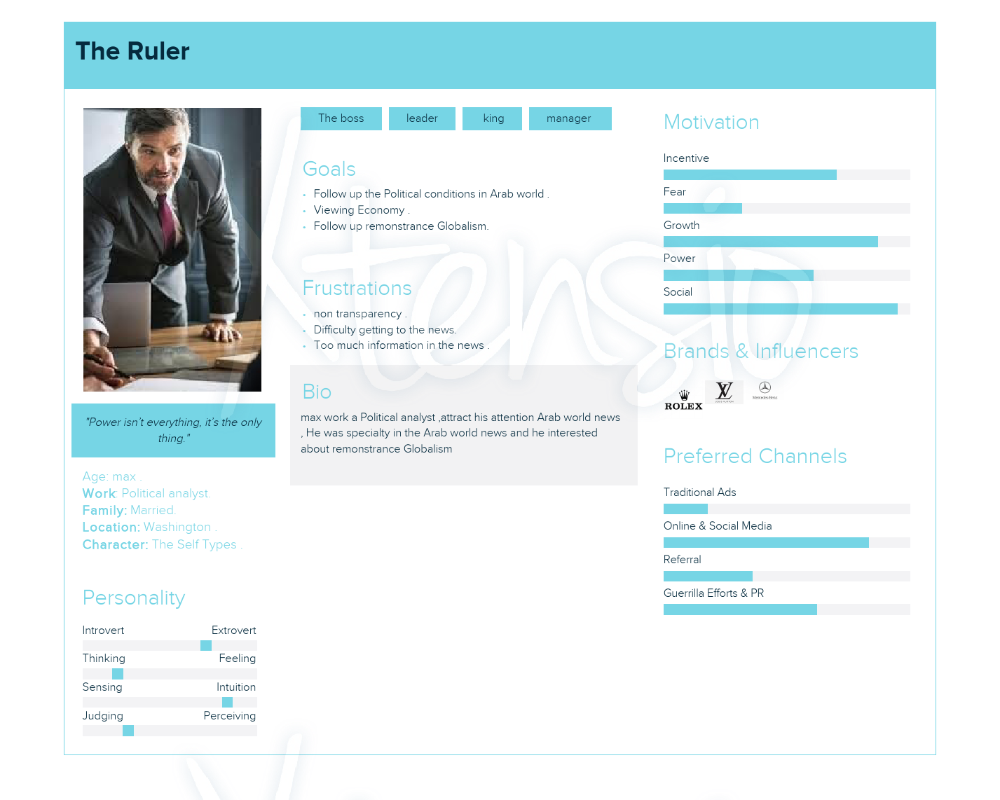
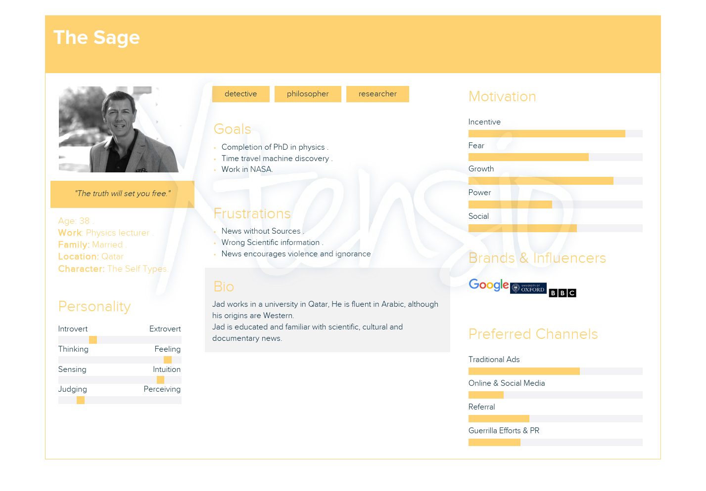
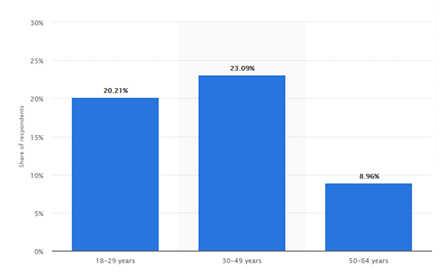
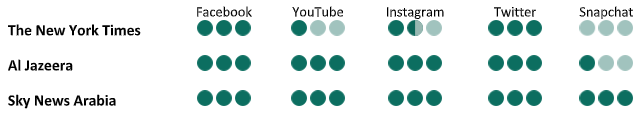

# team-project-1-news-

Palestine 
An-Najah National University 
Faculty of Information Technology 
Computerized Information Systems.
 
 
# LNN (Lightning News Network)
 
  ## Students :
   Ameer Abd-Alqader Qatmosh       11923652 
Abed alaziz Mohamad Kharobi    11925569 
Sama sami khraim                          11820435 
Malk kareem musa                       11925267                
Nabeel Hilal Abdoh 11822768 

## Supervisor :
Dr. Abd-Alrzaq Al-Natsheh
 
 
 
# Contents:

# Desctiption:
About the site: 
This website targets people over 25 years, unlike social media websites are displaying diversity of contents, our website's feed specifies in worldwide globe news. 
Especially the arabic world and Palestine news. 
Site content: a wide range of categorized news based geographic area, basically you can choose the type of news that you want based on your needs such as political ,technical and informatics news , this website also designed to show the breaking news at the same time which that incidents happens. 
 
   
   
# Introduction:
The goal of the website is to attract users to a website where they find all the news of the Arab world with ease credibility and knowledge of the latest news in the Arab world especially Palestine. 
To make it easier for users to access the latest news and the lowest possible costs from home or the workplace, we designed a website that provides you with all the benefits you need. 
As we see in our current situation and with the spread of the global epidemic of the COVID-19 virus, we are in dire need of remote communication sites that provide us with all the latest information, news and developments. 
Among our goals also and the main purpose of this site is to preserve the environment and reduce the logging used in the manufacture of paper used in newspapers and to protect ourselves and our families from infection with the epidemic that spreads through contact with non-sterile purposes. 
 
 
 
 
 
# The Audience:
 
 

**The following character is preferred for political news :** 

 
 
 
**The following character is preferred for cultural and scientific news:** 

 
 
 
 
 

# Competitive analysis

## Introduction :

We are working on aggregating all the news in one platform so that it can be obtained faster, with a design that attracts the user and makes him interact with him.

We made a competitive analysis of our News website with 3 similar News sites.

# Our Competitors:  

In the proposed competitive analysis, we will present three competitive news sites:

1. [nytimes](https://www.nytimes.com/)
2. [aljazeera](https://www.aljazeera.net/)
3. [skynewsarabia](https://www.skynewsarabia.com/)

We will conduct a competitive analysis of these sites.

# Overview (Preliminary Information)

### The New York Time :

An American website to the New York Times newspaper that contains news from several fields, created by The New York Times Company which was founded in 1851. 

All the news on this website is reliable, this is one of the most famous and best websites.

### sky News Arabia :

An Arabic website to the Sky News Arabia channel based in Abu Dhabi, this channel is from Sky Group which is UK-based, All the news on this website is reliable.

### Al-Jazeera:

An Arabic website to the Al-Jazeera channel based in Qatar, it is a famous and reliable website.

# Target Customers:

**The New York Times:** 
America in particular and the world at large given America, which is considered the first internationally, the graph below shows the age groups that read the newspaper in the year 2018.

  

 **Al Jazeera:**
Qatar in particular and the countries of the Middle East in general, Al Jazeera claims at least 40-million viewers in the Arab world. The majority of viewers in the survey that were not living in the Arab world watch it on satellite in the United States.

Viewers in the research ranged between the ages of 15 to over 40 years old. While most viewers report watching an average of 3 - 4 hours a day of Al Jazeera, viewers in the 15 - 29-year-old range spent more time watching, averaging an additional hour daily.

Furthermore, the male viewers clearly outnumber the female viewers in every age group.

**Sky News Arabia:** 
The United Arab Emirates and the Arab Gulf countries in the first degree, and the Middle East, broadcasting to over 50 million households.

# Marketing Strategy

## Social Media

**The New York Times**

| Facebook | [https://www.facebook.com/nytimes](https://www.facebook.com/nytimes) | More than 17M Likes |
| --- | --- | --- |
| YouTube | [https://www.youtube.com/user/TheNewYorkTimes](https://www.youtube.com/user/TheNewYorkTimes) | More than 3.M subscribers |
| Instagram | [https://www.instagram.com/nytimes/?hl=en](https://www.instagram.com/nytimes/?hl=en) | More than 9m followers |
| Twitter | [https://twitter.com/nytimes](https://twitter.com/nytimes) | More than [46M Followers](https://twitter.com/nytimes/followers) |

**Al Jazeera**

| Facebook | [https://www.facebook.com/aljazeera.net](https://www.facebook.com/aljazeera.net) | More than 2.5M Likes |
| --- | --- | --- |
| YouTube | [https://www.youtube.com/c/aljazeera](https://www.youtube.com/c/aljazeera) | More than 6.5M Subscribers |
| Instagram | [https://www.instagram.com/aljazeera/](https://www.instagram.com/aljazeera/) | More than 3M Followers |
| Twitter | [https://twitter.com/ajanet\_ar](https://twitter.com/ajanet_ar) | More than [110K Followers](https://twitter.com/ajanet_ar/followers) |

**Sky News Arabia**

| Facebook | [https://www.facebook.com/SkyNewsArabia](https://www.facebook.com/SkyNewsArabia) | More than 15M Likes |
| --- | --- | --- |
| YouTube | [https://www.youtube.com/skynewsarabia](https://www.youtube.com/skynewsarabia) | More than 1.5M Subscribers |
| Instagram | [https://www.instagram.com/skynewsarabia/](https://www.instagram.com/skynewsarabia/) | More than 2.1M Followers |
| Twitter | [https://twitter.com/skynewsarabia](https://twitter.com/skynewsarabia) | More than [5](https://twitter.com/ajanet_ar/followers)[.5M Followers](https://twitter.com/ajanet_ar/followers) |

## Interact on social media:

  

## Website :

## Content analysis :

### Does the site contain news only?  

**The New York Times :**  No. Style, arts, food, cooking, travel and other topics raised by the site. 
 
**Al Jazeera :**  Yes. The site contains many news topics, such as politics, economics, sports, technology…etc.
 
 **Sky News Arabia :**  Yes. The site contains many news topics, such as politics, economics, sports, technology. In addition to the latest news, Covid-19.
 

### Website Design
 
**The New York Times :** The design of the site is good, easy to handle and use, the design suggests the appearance of newspapers.
 
**Al Jazeera :**  Good website, nice design, easy to access and handle.The site contains the most viewed news and all social media platforms in addition to the live broadcasts.
 
**Sky News Arabia :**  The site contains a lot of news on the home page, and this makes it somewhat complicated to use.But it also contains the most read list, social media platforms, in addition to the live broadcast and breaking news.
 

###  Interact on the site
 
**The New York Times:**  The interaction on the site is not much because it is a news newspaper website and not a news channel site.But the news is presented periodically.
 
**Al Jazeera:**  News is displayed periodically on the site and arranged according to type of news (sports, politics, and so on).The interaction on the site is good and the most important daily news is presented on the home page.
 
**Sky News Arabia:**  The news is displayed periodically and intensively on the site with display the publication hour.
 

##

# Strength and weakness
<h3 align="center">  The New York Times </h3>
 
Strength | Weakness
------------ | -------------
Targets a high segment of viewers because it is in America | The newspaper is affiliated with America, as it is interested in news of America more broadly
The newspaper has a long history of news.|This reduces competition with our site, which will be primarily concerned with Palestine and the Arab world
 famous founder (Henry Jarvis Raymond) 
 A large number of followers on social media platforms.

<h3 align="center">  Al Jazeera </h3>

Strength | Weakness
------------ | -------------
It contains many channels (Al Jazeera News, English Island, Aljazeera live, Al Jazeera Documentary, The Balkan island, Arabic AJ +) |  Given the political situation between Qatar and the United Arab Emirates, this reduces competition with our website, which will neutralize the news
 A large number of followers on social media platforms.
 Al Jazeera claims at least 40-million viewers in the Arab world.
 
 <h3 align="center">  Sky News Arabia </h3>
 
 Strength | Weakness
------------ | -------------
This channel is a branch of sky news UK channel Its specialist to the Arab world | Given the political situation between Qatar and the United Arab Emirates, this reduces competition with our website, which will neutralize the news.
 Great interaction on social media platforms. 
 A large number of followers on social media platforms. 

[1](#sdfootnote1anc)[https://www.statista.com/statistics/229984/readers-of-the-new-york-times-daily-edition-usa/](https://www.statista.com/statistics/229984/readers-of-the-new-york-times-daily-edition-usa/)

[2](#sdfootnote2anc)[http://www.allied-media.com/aljazeera/JAZdemog.html](http://www.allied-media.com/aljazeera/JAZdemog.html)

[3](#sdfootnote3anc)[https://play.google.com/store/apps/details?id=com.grapplemobile.skynewsarabia&amp;hl=en](https://play.google.com/store/apps/details?id=com.grapplemobile.skynewsarabia&amp;hl=en)
